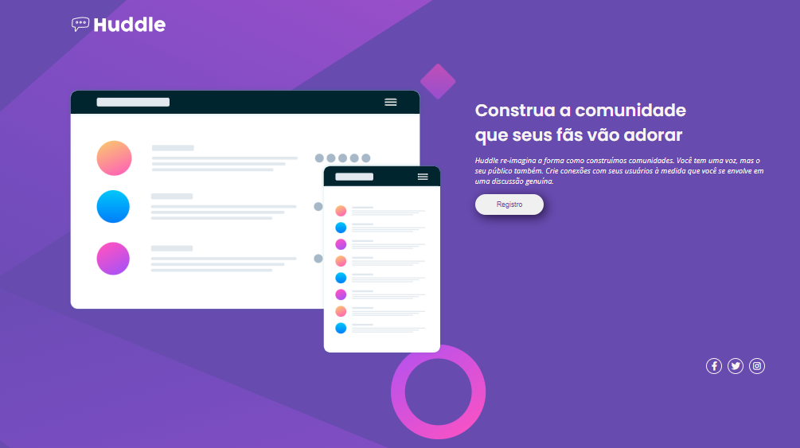
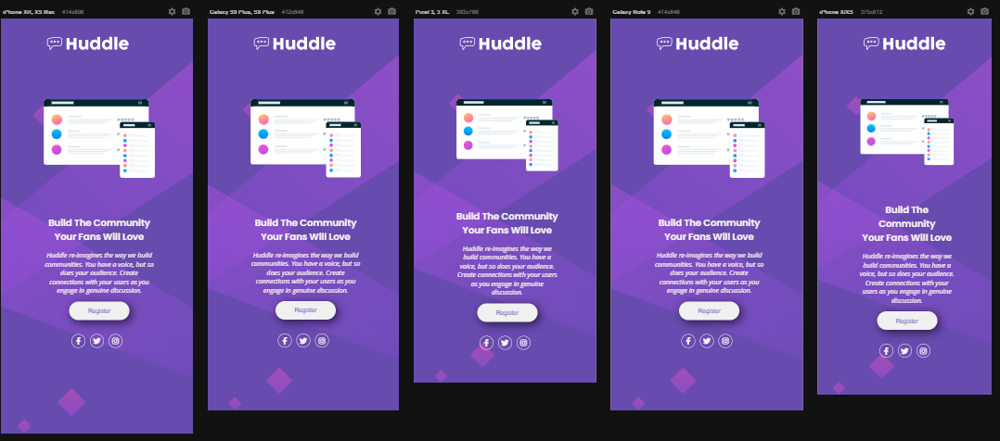

# Projeto Huddle Landing Page

## Descrição
    Esta é a solução do desafio do site Front End Mentor, visando reproduzir uma landig page o mais fiel possível, trabalhando com as linguagens descritas abaixo.

## Meu Processo

    •	Marcação semântica HTML5
    •	Propriedades personalizadas de CSS3
    •	Flexbox
    •	Design responsivo

## Designer

### Desktop

### Responsivo

## Autor
 GitHub: <a href="https://github.com/devkarine">DevKarine</a>  
FrontEndMentor: <a href="https://www.frontendmentor.io/profile/devkarine">DevKarine</a>  
CodePen: <a href="https://codepen.io/devkarine">DevKarine</a> 
        